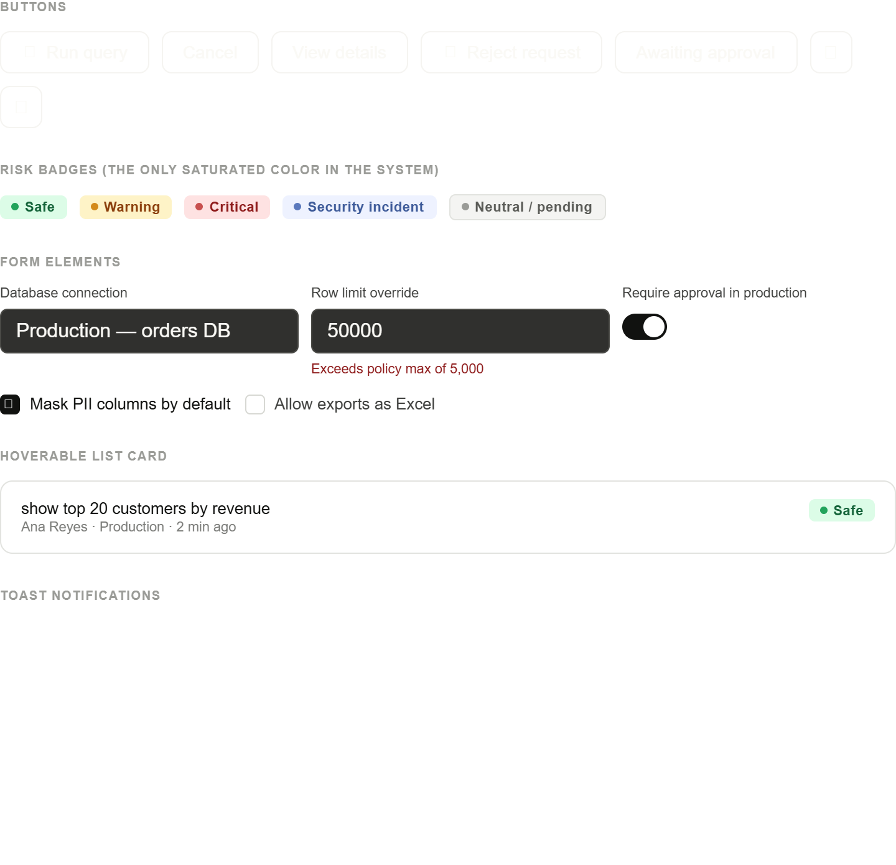
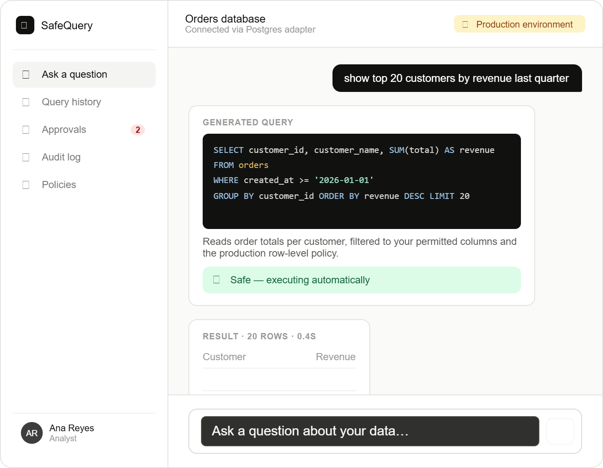
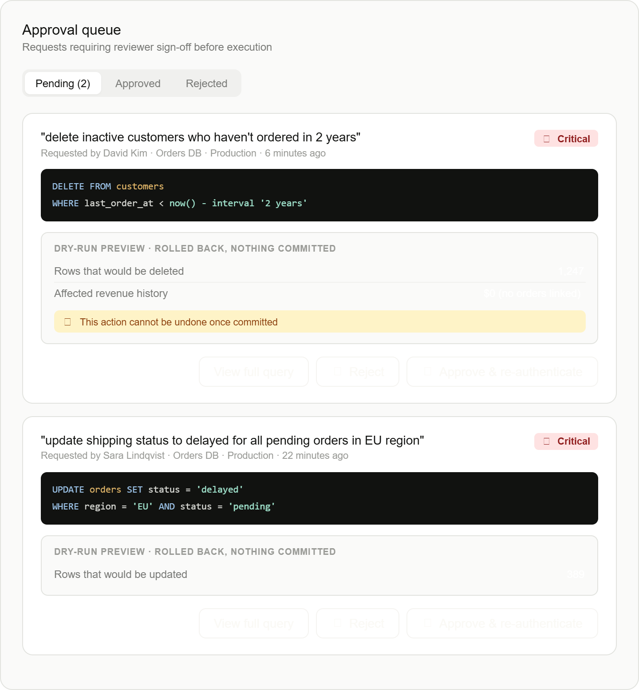
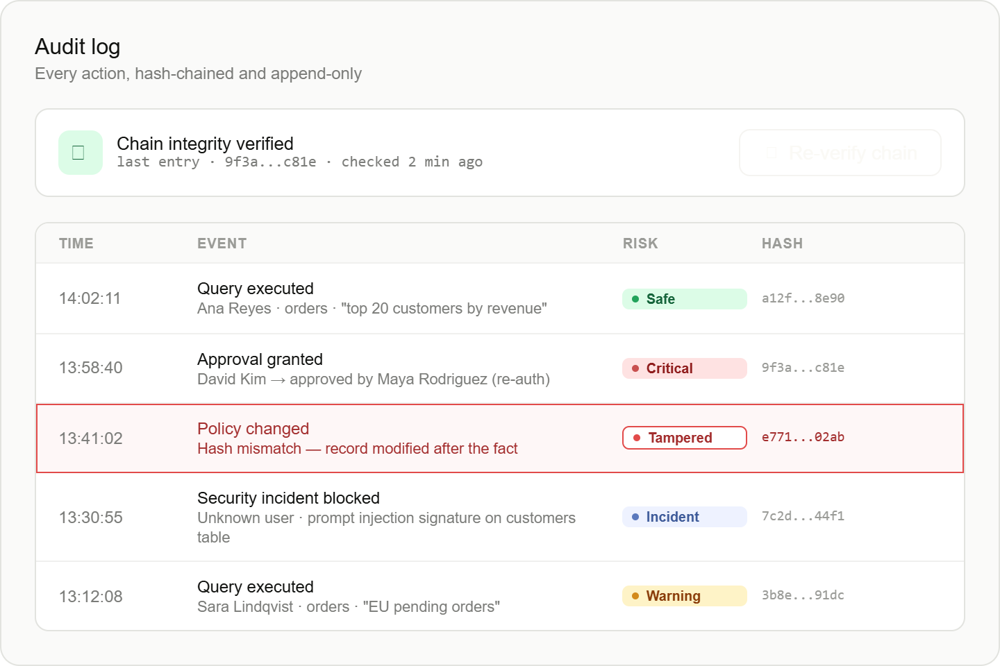
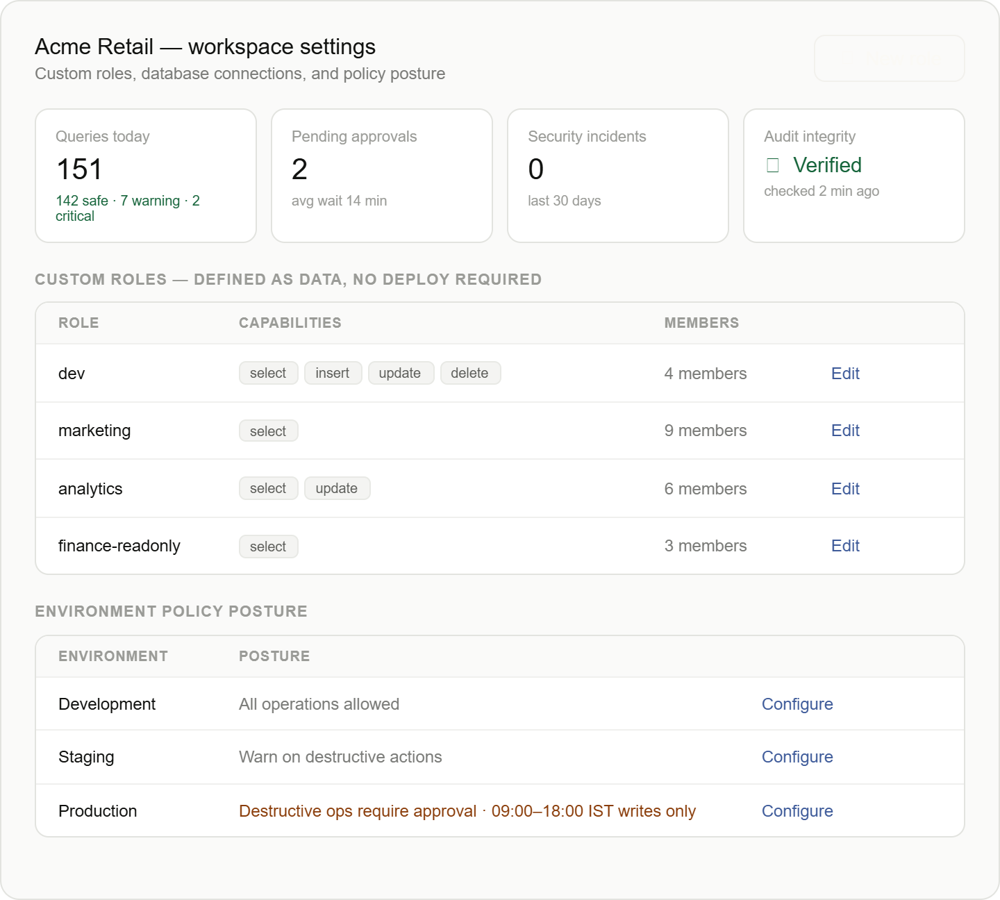
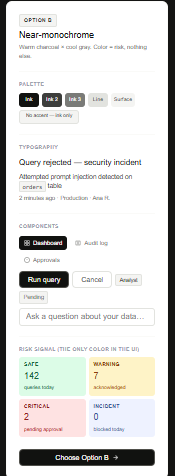

Good choice — Option B's restraint is exactly what makes the risk signals land. Let me build out the core screens plus a proper component library (buttons, toasts, inputs, modals) so you have a complete reference, not just a mood board.Let me build this as a multi-part reference: first the component library (buttons, inputs, toasts, badges, modals), then the actual product screens using those components.That's the component vocabulary — buttons (primary/secondary/ghost/danger/disabled/icon), risk badges with the dot-indicator pattern, form elements with inline validation, a hoverable list-row pattern, and toasts with a soft-tinted icon chip rather than a colored bar (more refined, less alert-banner-from-2015). Now let's put them to work in the actual product. I'll do the chat/query interface first, since that's the screen a visitor will spend the most time on.Notice the production-environment warning pill in the top bar — that small amber flag is doing real work: it's a constant ambient reminder of risk context without shouting. The SQL block uses a dark code chip (the one deliberate dark surface in an otherwise light system) which is a common, professional pattern for code and reads as "this is technical and precise" rather than breaking the monochrome rule, since it's content, not chrome.

Now the approval queue — this is the screen that has to convey "this is a serious decision" without resorting to alarm-red everywhere.The dry-run impact box is the centerpiece here — exact row counts from a real rolled-back transaction, not an estimate, sitting in a neutral gray panel so the only red in the whole card is the "Critical" badge itself. The fingerprint icon on the approve button is a deliberate nod to re-authentication being required, without needing extra copy to explain it.

Now the audit log with the hash-chain integrity check — this is the screen that proves the security story isn't just marketing.The tampered row is the payoff of the whole monochrome approach — because nothing else on the page is red, that single red outline reads as a genuine alarm rather than blending into a busy palette. This is the screen to lead a demo with.

One more — the admin dashboard with the custom-roles editor, since that's where your "dev/marketing/analytics roles as data" design decision becomes visible UI.That role table is the direct visual proof of the architecture decision we made earlier — "dev", "marketing", "analytics", "finance-readonly" are arbitrary admin-created names with arbitrary capability sets, sitting as plain rows, with the explicit caption "defined as data, no deploy required" doing the explaining for you in a demo.

A few notes on what's now established as your design language across all four screens: the dark `#111210` ink is reserved for primary actions and headings only — it never appears as a large fill except in the SQL code blocks, which read as "technical content" rather than breaking the light system. Risk color appears in exactly three places per screen at most — badge, dot, and sometimes a soft-tinted strip — never as a border around an entire card or a full-bleed background, which is what keeps it feeling calm rather than alarmed. Every interactive element (button, link, toggle) uses the same 8px radius and the same hover/active motion language (slight darken, scale 0.97 on press) so the whole interface feels like one system rather than four separately-designed screens.

